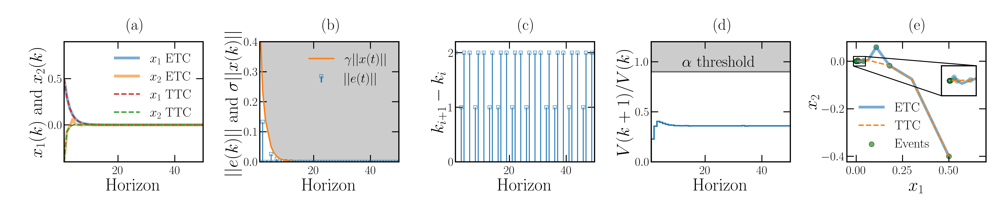

[Download here](https://zmanaa.github.io/files/KINETC.pdf)

Abstract
======
Event-triggered Control (ETC) presents a promising
paradigm for efficient resource usage in networked and em-
bedded control systems by reducing communication instances
compared to traditional time-triggered strategies. This paper
introduces a novel approach to ETC for discrete-time nonlinear
systems using a data-driven framework. By leveraging Koopman
operator theory, the nonlinear system dynamics are globally lin-
earized (approximately) in a higher-dimensional space. We design
a state-feedback controller and an event-triggering policy directly
from data, ensuring exponential stability in Lyapunov sense. The
proposed Koopman-Inspired Nonlinear Event-Triggered Control
from Data (KINETC) method is validated through extensive sim-
ulation experiments, demonstrating significant resource savings
by reducing the communication instances by 40%.

Main Findigs
======
Please refer to section IV of the paper for full discussion of the results. 

Manaa, Z.M., Abdallah, A.M., and El Ferik, S., 2024. KINETC: Koopman-Inspired Nonlinear Event-Triggered Control from Data.
